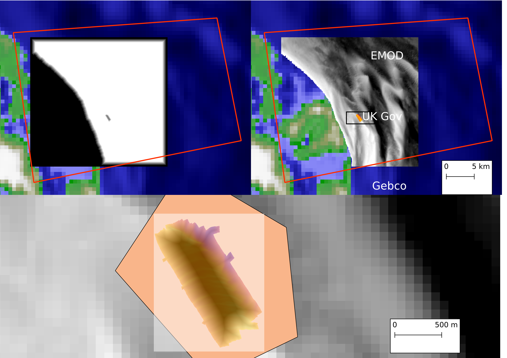
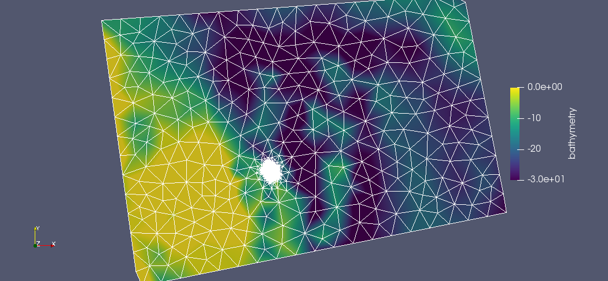
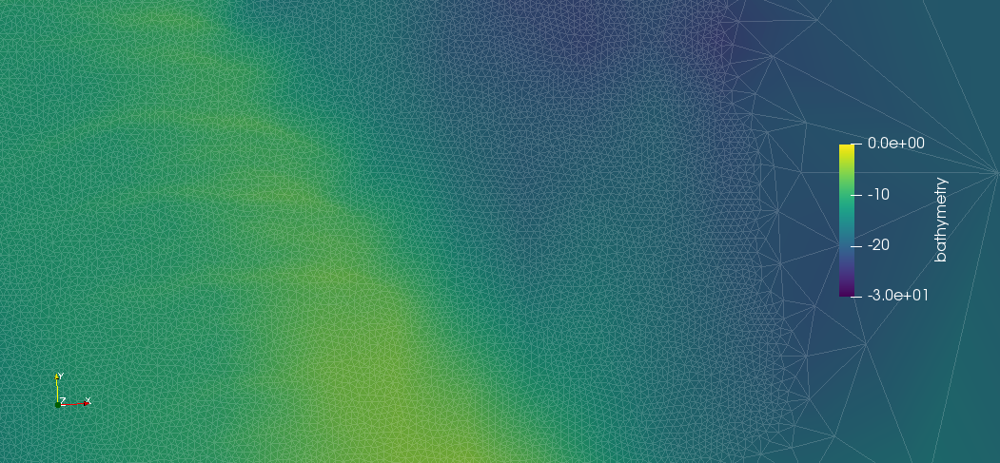

Introduction
============

What is hrds?
----------------

hrds is a python package for obtaining points from a set of rasters at different resolutions. 
You can request a point and hrds will return a value based on the highest resolution dataset 
(as defined by the user) available at that point, blending datasets in a buffer region to ensure 
consistency. The software assumes all rasters are in the same projection space and using the same datum.

About this document
-------------------

This document is the main manual for the software. It includes installation instructions,
some examples and comprehensive API documentation.

Prerequisites
-------------
* python 3+
* numpy
* scipy
* osgeo.gdal (pygdal) to read and write raster data

hrds is available on conda-forge, so you can install easily using:

.. code-block:: bash

    conda config --add channels conda-forge
    conda install hrds

It is possible to list all of the versions of hrds available on your platform with:

.. code-block:: bash

    conda search hrds --channel conda-forge

On Debian-based Linux you can also install manually. First  toinstall pygdal, 
install the libgdal-dev packages and binaries, e.g.

.. code-block:: bash

    sudo apt-get install libgdal-dev gdal-bin

To install pygdal, we neeed to check which version of gdal is installed:

.. code-block:: bash

    gdal-config --version

Install using pip, using the correct version as gleaned from the command above. Note you may need to 
increase the minor version number, e.g. from 2.1.3 to 2.1.3.3.

.. code-block:: bash

    pip install pygdal==2.1.3.3

Replace 2.1.3.3 with the output from the :code:`gdal-config` command.

You can install hrds using the standard:

.. code-block:: bash

    python setup.py install

Examples
---------------

This example loads in an XYZ file and obtains data at each point, 
replacing the Z value with that from hrds.

.. code-block:: python

    import sys
    sys.path.insert(0,"../../")

    from hrds import hrds

    points = []
    with open("test_mesh.csv",'r') as f:
        for line in f:
            row = line.split(",")
            # grab X and Y
            points.append([float(row[0]), float(row[1])])

    bathy = hrds("gebco_uk.tif", 
                 rasters=("emod_utm.tif", 
                          "inspire_data.tif"), 
                 distances=(700, 200))
    bathy.set_bands()

    print len(points)

    with open("output.xyz","w") as f:
        for p in points:
            f.write(str(p[0])+"\t"+str(p[1])+"\t"+str(bathy.get_val(p))+"\n")

This will turn this:

.. code-block:: none

    $ head test_mesh.csv 
    805390.592314,5864132.9269,0
    805658.162910036,5862180.30440542,0
    805925.733505999,5860227.68191137,0
    806193.304101986,5858275.05941714,0
    806460.874698054,5856322.43692232,0
    806728.445294035,5854369.81442814,0
    806996.015889997,5852417.19193409,0
    807263.586486046,5850464.56943942,0
    807531.157082069,5848511.94694493,0
    807798.727678031,5846559.32445088,0

into this:

.. code-block:: none

    $ head output.xyz 
    805390.592314	5864132.9269	-10.821567728305235
    805658.16291	5862180.30441	2.721575532084955
    805925.733506	5860227.68191	2.528217188012767
    806193.304102	5858275.05942	3.1063558741547865
    806460.874698	5856322.43692	5.470234157891056
    806728.445294	5854369.81443	1.382685066254607
    806996.01589	5852417.19193	1.8997482922322515
    807263.586486	5850464.56944	4.0836843606647335
    807531.157082	5848511.94694	-2.39508079759155
    807798.727678	5846559.32445	-2.401006071401176

Example of use via [thetis](http://thetisproject.org/):

.. code-block:: python

    from firedrake import *
    from thetis import *
    from firedrake import Expression
    import sys
    sys.path.insert(0,"../../")
    from hrds import hrds

    mesh2d = Mesh('test_mesh.msh') # mesh file

    P1_2d = FunctionSpace(mesh2d, 'CG', 1)
    bathymetry2d = Function(P1_2d, name="bathymetry")
    bvector = bathymetry2d.dat.data
    bathy = hrds("gebco_uk.tif", 
                 rasters=("emod_utm.tif", 
                          "inspire_data.tif"), 
                 distances=(700, 200))
    bathy.set_bands()
    for i, (xy) in enumerate(mesh2d.coordinates.dat.data):
        bvector[i] = bathy.get_val(xy)
    File('bathy.pvd').write(bathymetry2d)

These images show the original data in QGIS in the top right, with each 
data set using a different colour scheme (GEBCO - green-blue; EMOD - grey; 
UK Gov - plasma - highlighted by the black rectangle).The red line is the 
boundary of the mesh used (see figure below). Both the EMOD and UK Gov data 
has NODATA areas, which are shown as transparent here, hence the curved 
left edge of the EMOD data.  The figure also shows the buffer regions created 
around the two higher resolution datasets (top left), with black showing that 
data isn't used to white where it is 100% used. The effect of NODATA is clear
here. The bottom panel shows a close-up of the UK Gov data with the buffer overlayed
as a transparancy from white (not used) to black (100% UK Gov). The coloured polygon
is the area of the high resolution mesh (see below).

    The raster data used in the above examples consisting of GEBCO (top left), EMOD (top right) and Inspire data (bottom).
    the buffer zones generated by the example are also shown and the highest resolution zone has been overlaid onto the
    Inspire data set (bottom) as a greyscale shading (white is 0, black is 1).

After running the code above, we produce this blended dataset. Note the coarse mesh used
here - it's not realistic for a model simulation!

    A contrived mesh used in the example. We have a very high resolution area in the centre.

If we then zoom-in to the high resolution area we can see the high resolution UK Gov data
being used and with no obvious lines between datasets.

    The bathymetry data, which al lhave different resolution, are smoothly blended onto our mesh.

